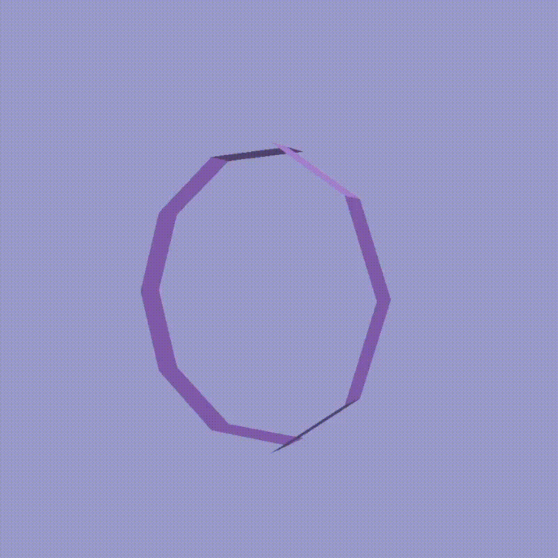
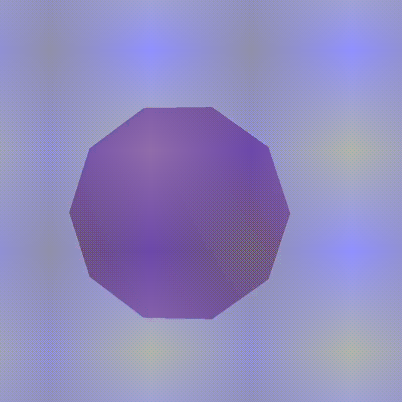
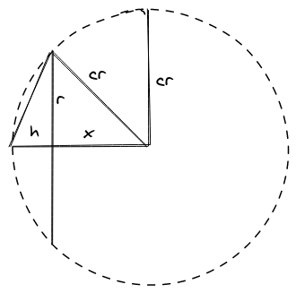
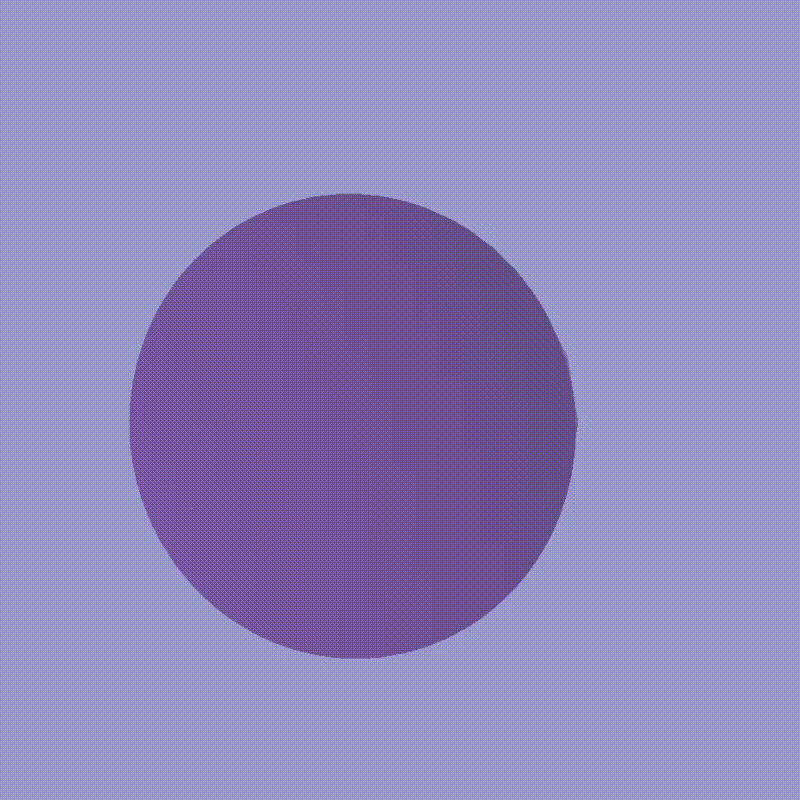

# Project Report

This project really has two parts:
    - An interactive local illumination renderer
    - A Software Ray Tracer

The basic workflow is as follows:
1. Read the scene definition from the yaml file
2. Tessellate the various lenses from their definitions
3. Build a kdtree to accelerate ray/triangle intersection tests
4. Spawn all necessary rays and trace through the scene, recording each segment between collisions
5. Tessellate the ray segments
6. Upload geometry to the gpu
7. Begin the draw loop

## Object Tessellation

### Flat

For flat lenses tesselation simply cuts the circle into pizza slices which
correspond to the triangles for that lens. Special care must be given to ensure
that the triangles are defined in counterclockwise order:



With the proper implementation we get a simple flat lens:



### Convex / Concave

Convex lenses provide a more interesting challenge. The first tricky bit is
understanding how to take a convex lens with radius `r` that sticks out `h`
and extract the meaningful angles and values for tesselation. Consider the
following diagram:



Specifically we care about deriving `cr` and `x`. We make two key observations:

1. `cr = h + x`
2. `cr^2 = x^2 + h^2`

Solving this system of equations for x:

```
x = (r^2 - h^2) / (2 * h)
cr = h + x
```

Additionally we can calculate the angle of the triangle `theta`:

```
theta = arccos(x/cr)
```

We then do a latitude/longitude sweep from `-theta` to `theta`, tesselating a
new square converting the latitude/longitude pairs to x,y,z coordinates.

This tesselates the correct spherical curve and meshes well with the other
shapes, but it creates a square cutout of the surface of the sphere instead of a
circular one.

We rememdy this first by removing all triangles that have no points within the
circle. Then for every remaining vertex that is outside the circle we move it to
the closest point on the edge of the circle and adjust its depth value according
to the slope of the curve.

Finally all vertices are translated `x` units so the lens will be at the origin.

For concave lenses the process is the same but the normals are flipped.



### Cylinders

For each type of lens there is an optional offset parameter to provide depth
between the two faces. In the case that the offset is greater than one a
cylinder is generated to connect the two sides of the lens.

## Ray Tracing

The ray-tracing process is very simple. Each light spawns all of its rays. Each
ray is tested for collision with objects in the scene using a kdtree as an
acceleration structure. Upon collision, the material of the collided triangle is
checked, if it is solid tracing stops, if it is glass then the ray refracts
using snells law and recurs through the tracing method.

## Uploading Geometry

All geometry is uploaded to the gpu in with a single vertex/index/normal buffer.
However, since uniforms are per model, which are a subset of the geometry
uploaded to the buffer, we keep track of the which triangle the model starts at
and how many triangles are in the model:

```rust
struct Model {
    index: u32,
    count: u32
}
```

Later when constructing our command buffer, we loop over all of the models and
add an `draw_indexed` call:

```rust
// builder is an AutoCommandBufferBuilder
for m in models.iter)() {

    builder
        // (add descriptor set with uniform, omitted for brevity)
        .draw_indexed(
            m.count * 3,        // number of indices
            1,                  // number of instances
            model.index * 3,    // starting index
            0,                  // vertex_offset
            0                   // first_instance
        )
        .unwrap();
}
```

## Rendering

I put special care into how my pipeline works in order to give the best
experience. My stylistic goal was fairly flat shading with still discernable
surfaces and angles.

To this end, I combined alpha blending for the transparent lenses with
backface culling. This causes the back of the lens not to be rendered, meaning
that it won't add to the alpha channel. This means that the amount that the lens
blends with its background is constant, and I think looks pretty nice.

However, the cell shading I was originally using lost too much detail, so I
switched to a regular diffuse term while keeping the cell-style specular and rim
shading


## Interactivity

For the interactive elements I hooked user inputs into changing global uniforms
for the scene. Scrolling changes the vertical field of view for my perspective
matrix and clicking and dragging changes the global rotation uniform for the
scene.

## Enhancements

The biggest enhancement is fixing how the rays are rendered. Currently every
single ray is tesselated into its own unique geometry and then uploaded to the
gpu. It would be much more efficient to render the ray segments in a compute
shader with a depth component and then passed to the rest of the rendering
pipeline to be blended in.

If this is accomplished it would be much easier to make this project truly
interactive, meaning that the scene could be dynamically changed and we could
watch the rays begin traced through the scene.

Beyond that, my tesselation algorithm only generates triangles, and the triangle
then calculates its normals. It would be better to produce a list of vertices,
indices, and normals, which would allow for each vertex to preserve its true
normal at that point, also allowing the gpu to interpolate the normals across
the surface of the triangle.
